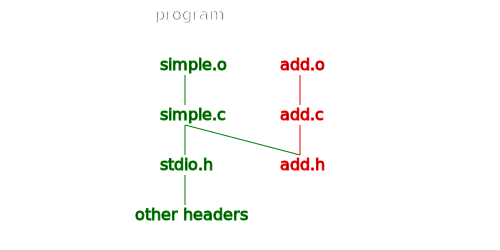

# The C++ Build Process

> The last good thing written in C was Franz Schubert's Symphony Number 9.
>
> -- Erwin Dieterich

> Fifty years of programming language research, and we end up with C++?
>
> -- Richard A. O’Keefe

> There are only two kinds of programming languages: those people always bitch
> about and those nobody uses.
>
> -- Bjarne Stroustrup

The C++ build process is built on top of the C build process which was hacked
together in 1972 on a PDP-7 with at most 144 KB of RAM. Honestly, I'm surprised
it aged so well.


The exact linking process in C and C++ isn't standard, it's up to each compiler
to make things work. Most compilers behave in the same way with small
differences but we'll be focusing on the GNU tools to keep things simple.

## An Overview

Computers in 1972 weren't very powerful and so the process had to be broken down
into smaller steps. This also allows you to rebuilt only the parts of the tree
that change.

- we have many C/C++ files,
- we executed the pre-processor in each file,
- this pulls in every header and its parents,
- each file independently gets converted into an object file,
- every object file is linked to form an executable or library.



## Trivial C Program

Let's use a trivial C program to illustrate the build process. We can build it with the following commands:

```
cc -Wall -O0 -std=c99 -g -c -o add.o add.c
cc -Wall -O0 -std=c99 -g -c -o simple.o simple.c
```

### add.h

```c
#ifndef __ADD_H__
#define __ADD_H__

int add(int a, int b);
int sub(int a, int b);

#endif // __ADD_H__
```

### add.c

```c
#include "add.h"

int add(int a, int b)
{
    return a + b;
}

int sub(int a, int b)
{
    return a - b;
}
```

### simple.c

```c
#include <stdio.h>

#include "add.h"

int main(int argv, char **argc)
{
    printf("%i\n", sub(add(5, 6), 6));

    return 0;
}
```

## Pre-processor

Whenever you see a directive that starts with `#`, we are dealing with the C++
pre-processor. The pre-processor does the following:

- include files (`#include`),
- macro expansions (`#define RADTODEG(x) ((x) * 57.29578)`),
- conditional compilation (`#if`, `#ifdef`, etc.),
- line control (`__FILE__`, `__LINE__`).

Basically, the compiler has a state which can be modified by these directives.
Since every `*.c` file is treated independently, every `*.c` file that is being
compiled has its own state. The pre-processor works by replacing the tags in the
source file by the result based on the state of the compiler.

We'll focus on the includes and the include guards. An include is really simple,
it finds the file and replaces the `#include` line with the contents of that
file.

Where does it find the files?

- `#include <sum.h>` looks for `sum.h` in a list of include directories,
- `#include "sum.h"` does the same but looks in the current folder first.

C and C++ don't actually provide a mechanism for providing a list of include
directories, that is up to the compiler which causes a few problems with cross
platform development.

When you include a file, there is an include guard. This include guard sets a
variable the first time it is run so that including the same file a second time
doesn't cause any problems.

```
#ifndef __FILENAME__
#define __FILENAME__

// code

#endif
```

It's a very useful trick but it's also one of the more fundamental problems of
C:

- you include a file a first time,
- it modifies the compiler state,
- you include the same file a second time,
- based on the compiler state, it pretends to be empty.

This is completely crazy, the file you include can change based on the status of
the compiler. No only that but the included files themselves can modify the
status of the compiler.

This also makes compiling really long and really hard. Suppose that we want to
compile two files which both include `<string.h>` and that `<string.h>` itself
includes about 50 other files. We are not able to cache `<string.h>` without
proving that the compiler state is the same when we include it!

So what started out as a simple, easy to implement solution turns out to scale
really poorly. This wasn't a problem in 1972 when the computer limited the
complexity but almost 50 years later, it's a big problem. The C++ standards
committee has been trying to introduce a module system to fix this problem but
it's a difficult task to change such a fundamental system in an established
language.

## Header Trees

When you include a header, this header can include others and it can quickly get
messy. If we compile a file with the `-H` flag, we can visualize the various header graphs:

```
gcc -H -O0 -std=c99 -g -c -o simple.o simple.c
```

- /usr/include/stdio.h
  - /usr/include/bits/libc-header-start.h
    - /usr/include/features.h
      - /usr/include/sys/cdefs.h
        - /usr/include/bits/wordsize.h
        - /usr/include/bits/long-double.h
      - /usr/include/gnu/stubs.h
        - /usr/include/gnu/stubs-64.h
  - /usr/lib/gcc/x86_64-pc-linux-gnu/8  2  1/include/stddef.h
  - /usr/lib/gcc/x86_64-pc-linux-gnu/8  2  1/include/stdarg.h
  - /usr/include/bits/types.h
    - /usr/include/bits/wordsize.h
    - /usr/include/bits/typesizes.h
  - /usr/include/bits/types/__fpos_t.h
    - /usr/include/bits/types/__mbstate_t.h
  - /usr/include/bits/types/__fpos64_t.h
  - /usr/include/bits/types/__FILE.h
  - /usr/include/bits/types/FILE.h
  - /usr/include/bits/types/struct_FILE.h
  - /usr/include/bits/stdio_lim.h
  - /usr/include/bits/sys_errlist.h
- add.h

We can see that we go from 2 includes to 22. This can quickly get out of hand
for big projects. For example, if we had a source file that included OpenCV and
ROS, it could easily balloon to 1500 or so header files. That means that to
compile our single file, the compiler would have to visit over 1500 files.

## An Object File

Once the pre-processor has had a chance to run and put the tree of includes into
our starting file, we can compile the source file to an object file. An object
file is a collection of different bits of data, assembly and debugging symbols
arranged so that it can all be easily accessible. We can look at an object file
with the `objdump` command:

```
objdump -dr simple.o
```

### simple.o

```
simple.o:     file format elf64-x86-64


Disassembly of section .text:

0000000000000000 <main>:
   0:	55                   	push   %rbp
   1:	48 89 e5             	mov    %rsp,%rbp
   4:	48 83 ec 10          	sub    $0x10,%rsp
   8:	89 7d fc             	mov    %edi,-0x4(%rbp)
   b:	48 89 75 f0          	mov    %rsi,-0x10(%rbp)
   f:	be 06 00 00 00       	mov    $0x6,%esi
  14:	bf 05 00 00 00       	mov    $0x5,%edi
  19:	e8 00 00 00 00       	callq  1e <main+0x1e>
			1a: R_X86_64_PLT32	add-0x4
  1e:	be 06 00 00 00       	mov    $0x6,%esi
  23:	89 c7                	mov    %eax,%edi
  25:	e8 00 00 00 00       	callq  2a <main+0x2a>
			26: R_X86_64_PLT32	sub-0x4
  2a:	89 c6                	mov    %eax,%esi
  2c:	48 8d 3d 00 00 00 00 	lea    0x0(%rip),%rdi        # 33 <main+0x33>
			2f: R_X86_64_PC32	.rodata-0x4
  33:	b8 00 00 00 00       	mov    $0x0,%eax
  38:	e8 00 00 00 00       	callq  3d <main+0x3d>
			39: R_X86_64_PLT32	printf-0x4
  3d:	b8 00 00 00 00       	mov    $0x0,%eax
  42:	c9                   	leaveq
  43:	c3                   	retq
```

This is what the most complex file in our tiny example looks like. The important
thing to notice is that the assembly code is grouped into the `<main>` function
and that there are calls to functions that don't yet exists:

```
25:	e8 00 00 00 00       	callq  2a <main+0x2a>
			26: R_X86_64_PLT32	sub-0x4
```

Above is a call to the unknown function `sub`.

## Symbol Tables

The important things in an object files are the functions it provides and the
functions it needs. We can get a summary of the exports and imports of functions
and variables from the symbols tables at the start of the object file. Every
function is known as a `symbol` in the object file. We can simply look at the
different symbol tables to get an idea of what is in our object table.

To get symbol tables, we use the following commands:

```
nm add.o > add.sym
nm simple.o > simple.sym
```

### add.o

| Position | Section | Name |
|        - | -       | -    |
|        0 | Text    | add  |
|       14 | Text    | sub  |

### simple.o

| Position | Section   | Name                  |
| -        | -         | -                     |
|          | Undefined | add                   |
|          | Undefined | _GLOBAL_OFFSET_TABLE_ |
| 0        | Text      | main                  |
|          | Undefined | printf                |
|          | Undefined | sub                   |

## A Linker's Job

When we want to build an executable, we have to have the function calls call the
right function. To do this, we have a few options:

1. Put everything in a continuous file and jump directly to the function.
2. Keep everything in separate files and assemble them before running. Keep a
   table of offsets to functions and look up where to jump.

The first option describes static linking. This is more efficient, less flexible
and rarely used.

The second option describes dynamic linking. It is a little bit slower but much
more flexible and is the standard way to ship a library.

## Differences in C++

C++ was designed to be compatible with the C build process. In fact, the first
C++ compiler was implemented as a pre-compiler that transformed a C++ source file
into C.

Modern C++, introduces two big differences:

- templates,
- mangling.

Templates are complicated enough to have their own tutorial. Mangling is pretty
simple and important. The following source file gives us an idea of mangling:

```c++
extern "C" int add_c(int a, int b)
{
    return a + b;
}

int add(int a, int b)
{
    return a + b;
}

int add(const int *a, const int &b)
{
    return *a + b;
}

float add(float a, float b)
{
    return a + b;
}

namespace manu
{
    int add(int a, int b)
    {
        return a + b;
    }
}
```

If we look at it with `nm`:

```
nm mangling.o
```

| Position | Section | Name            |
|        - | -       | -               |
|        0 | Text    | add_c           |
|       44 | Text    | _Z3addff        |
|       14 | Text    | _Z3addii        |
|       28 | Text    | _Z3addPKiRS_    |
|       5e | Text    | _ZN4manu3addEii |

Basically, in C, functions are simply identified by their names. This prevents
us from having namespaces and static dispatch. C++ gets around this by using
mangling. `extern "C"` turns off mangling so that C++ can be compatible with C.

Unfortunately, many compilers do mangling differently and so are incompatible.
Luckily, most compilers have standardized on what you see above.

- start with `_Z` since underscore capital letter is reserved in C,
- an `N` after the `Z` indicates nested names,
- put numbers that indicate the length of the next argument,
- this gives us a list of strings,
- the last string is the function, class or struct name,
- the previous ones are the namespace,
- if our names were nested, we insert an `E`,
- we indicated the type and modifiers of our arguments.
