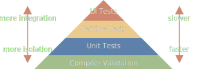

# Leveraging types for better APIs

## Modules and interfaces

> Well-designed computational systems, like well-designed automobiles
> or nuclear reactors, are designed in a modular manner, so that the
> parts can be constructed, replaced, and debugged separately.
>
> — [Structure and Interpretation of Computer Programs](https://mitp-content-server.mit.edu/books/content/sectbyfn/books_pres_0/6515/sicp.zip/full-text/book/book-Z-H-9.html#%_chap_1)

Software is built by breaking a complex problem down into smaller
modules that each solve a simpler problem. We can further break down a
module we just created into ever smaller parts until we have something
simple enough to work with.

All of these modules then have to be connected to each other to solve
our original, more complex problem. Connecting these modules together
can in itself become a difficult problem — especially as the number of
modules increases.

The key to managing the complexity that arises from connecting modules
together is having well-defined interfaces. A well-defined interface
is typed in such a way that we can rely on compilers to ensure that we
respect the interfaces that we use.

When modules are written in the same programming language, the typing
information for the interfaces is usually already in place. Often
though, modules are written in different languages or are written by
different organizations and so the typing information is
missing. Adding typing formation to those interfaces presents a great
opportunity to improve the software we write.

We often overlook the quantity errors that can be caught by the
compiler when it has good type information. There are surprisingly few
typing techniques that we need to avoid many common errors. With these
techniques, compiler validation becomes the most powerful tool for
catching errors.

The traditional test automation pyramid[^pyramid] has unit tests as a
foundation but it might be better to place compiler validation bellow
unit tests. Unit tests validate that assertions given by the tests
hold true — compilers are able to validate that assertions given by
the types hold true. Here's what our updated test automation pyramid
can look like.



With this in mind, the questions becomes

> What type information can we give the compiler to help us catch
> errors, especially, around our interfaces?

## Static type checking

> Code never lies, comments sometimes do.
>
> — Ron Jeffries

The most basic type contract is being able to specify what type of
value you expect to find in a variable. Most programming languages
have static typing built-in but server requests often lack typing
information — the data is often untyped `json` or `xml`.

To show an example of typing at work, we can use Typescript with
simple functions as our interface. Typescript lets us easily compare a
typed function and an untyped equivalent to highlight errors that
typing can prevent. Even though a function is used here, it's
important to remember that this also applies to the interfaces between
our modules.

```typescript
function typed_sum(a: number, b: number): number {
  return a + b;
}

/**
 * Well intentioned comments.
 *
 * @param a is a number
 * @param b is a number
 *
 * @returns a number
 */
function untyped_sum(a, b) {
  return a + b;
}

// Behaviour that is hard to predict, potential bugs
untyped_sum("1", "2"); // → "12"

// A compiler error
typed_sum("1", "2");
```

## Null safety

> I call it my billion-dollar mistake. It was the invention of the
> null reference in 1965… This has led to innumerable errors,
> vulnerabilities, and system crashes, which have probably caused a
> billion dollars of pain and damage in the last forty years.
>
> — Tony Hoare

Null references have been around for a long time but null safety has
resurfaced in the last 10 years[^null]. The concept is simple, you
have to indicate when a value can be missing. The alternative — any
value can be missing without warning — sounds crazy but it's been a
standard part of many programming languages for so long that we've
developed Stockholm syndrome.

Using a value as if it was there when it isn't leads to crashes or
unexpected behaviour. With null safety, when a value is potentially
missing, the compiler can make sure we do a null check before the
value can be used.

It's incredible to see how many errors disappear with this simple
change. This is especially true across interfaces, the errors are
usually harder to diagnose and resolve because of the extra distance
between the two pieces of code.

Once again, Typescript lets us illustrate both sides of the coin in
the same program using functions.

```typescript
function nullsafe_sum(a: number, b: number): number {
  return a + b;
}

function untyped_sum(a, b) {
  return a + b;
}

// Behaviour that is hard to predict, potential bugs
untyped_sum(5, null);      // → 5
untyped_sum(5, undefined); // → NaN (Not a Number)

// Caught by the compiler
nullsafe_sum(5, null);      // Compiler error
nullsafe_sum(5, undefined); // Compiler error
```

## Tagged unions

> The best way to eliminate exception handling complexity is to define
> your APIs so that there are no exceptions to handle: define errors
> out of existence.
>
> — A Philosophy of Software Design

Just like null safety, tagged unions aren't a new concept[^taggedold]
but are becoming a standard part of many new programming
languages[^taggednew].

Tagged unions allow us to create data structures that better fit our
use cases. They do this by being able to represent a choice as
data. Each choice has its own associated data.

When used correctly, the ability to represent a choice makes
inconsistent states impossible to represent. It's surprising how many
errors ultimately boil down to ambiguous states.

### State with tagged unions

The simplest choice we can represent is true or false. This is often
useful when we want to represent the return value of a function that
can fail. The successful case is mapped to `true` and we associate the
normal result of the function with it. The error case is mapped to
false and we associate an error message with it.

This sounds more complex than it is, hopefully another Typescript
example can clear things up.

```typescript
interface Result {
  tag: 'result';
  value: number;
}

interface Error {
  tag: 'error';
  message: string;
}

function divide(a: number, b: number): Result | Error {
  if (b === 0) {
    return {
      tag: 'error',
      message: "Can't divide by 0",
    };
  }

  return {
    tag: 'result',
    value: a / b,
  };
}
```

This might look a lot like exceptions but there are two key
differences.

1. Exceptions modify a program's control flow which makes it hard to
   transfer across to another process or program.
2. Tagged unions combine with other data types, we can have a list of
   results or errors.

The example above is the simplest case where there are only two states
— tagged unions work for more than just two states.

Let's say we have a device that start out as offline. It then connects
to our server and downloads docker images as part of an initializing
phase. Once those images are booted up and sending us sensor data, the
device is considered online. We can model that with the diagram below

If we had to represent this without tagged unions, we might combine
all the different states into one bigger data structure and have
`null` for the parts that don't make sense in the current state.

```typescript
interface Device {
  status: 'offline' | 'initializing' | 'online';
  ip: string | null;
  progress: number | null;
  sensorData: SensorData | null;
}
```

With this approach, knowing which fields have meaningful values based
on the current `status` is implicit information. When programs get big
and there are many interfaces, this quickly becomes extremely
complex.

Another shortcoming of this approach is that it's possible to have
states that don't make any sense, what does it mean when an `offline`
device that has an `ip`?

Tagged unions solve both of these problems as can be seen bellow

```typescript
interface OfflineDevice {
  status: 'offline';
}

interface InitializingDevice {
  status: 'initializing';
  ip: string;
  progress: number;
}

interface OnlineDevice {
  status: 'online';
  ip: string;
  sensorData: SensorData;
}

type Device = OfflineDevice | InitializingDevice | OnlineDevice;
```

Another approach without tagged unions would be to use the same data
structures as nullable.

```typescript
interface Device {
  offline: OfflineDevice | null;
  initializing: InitializingDevice | null;
  online: OnlineDevice | null;
}
```

This approach still leaves us with the possibility of having a
contradicting state that doesn't make sense. What do you do with a
device if every field is null or if all three have values?

### Lists with tagged unions

Tagged unions are also useful to represent a list of different
types. Many programming languages use inheritance to model such a list
but, just like exceptions, inheritance acts on a program's control
flow. Whenever we are interacting with the control flow, crossing the
process boundary and combining with other typing concepts becomes
difficult.

Let's say a connected devices can be robots, sensors or servers — each
with their own associated information.

With tagged unions, we can have a list that combines multiple types.

```typescript
const devices = (Robot | Sensor | Server)[];
```

Without tagged unions, we could fall back to having multiple lists —
one per type. The downside of this approach is that the sorting
information is lost as one list is decoupled into three.

```typescript
const robots = Robot[];
const sensors = Sensor[];
const servers = Server[];
```

## Conclusion

A modern type system, offering **static types**, **null safety** and
**tagged unions** is a powerful tool that enables the compiler to
catch many errors with little effort. Interfaces are one of the most
important places to apply typing as that can serve as a contract
between modules that is enforced by the compiler.

When we don't have static type checking, we rely on informal
agreements:

- comments,
- documentation,
- meeting notes,
- best practices,
- hopeful optimism,
- …

What all these have in common is that they rely on developers to
ensure everything fits and when we don't respect the agreements, we
get run-time crashes or unexpected behaviour.

These agreements are usually respected at first but start to break as
the program grows and evolves. This is especially painful for
interfaces where it's harder to make sure that both sides of the
interface evolve in the same way.

[^pyramid]: Test Automation Pyramid — [Succeeding with Agile](https://www.mountaingoatsoftware.com/books/succeeding-with-agile-software-development-using-scrum) (Mike Cohn)

[^tagged1]: Tagged unions have other names:
    **variant**, **choice type**, **discriminated union**, **sum type**.

[^taggedold]: Early languages implementing tagged unions
    **ALGOL 68**, **ML**, **Pascal**, **Ada**, **Modula-2**,
    **Haskell**.

[^taggednew]: New languages implementing tagged unions
    **Rust**, **Swift**, **Scala**, **Typescript**, **Kotlin**,
    **Python 3.9+**.

[^null]: A few languages with null safety
    **Typescript**, **Rust**, **Kotlin**, **Swift**.
